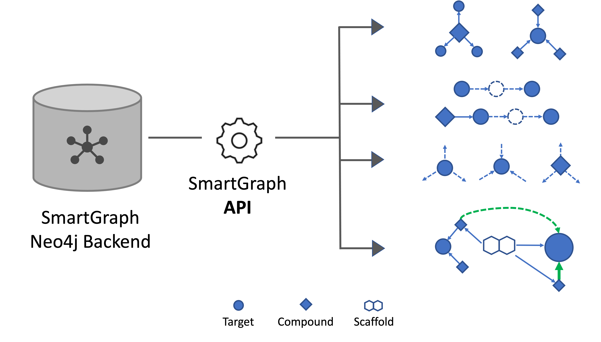
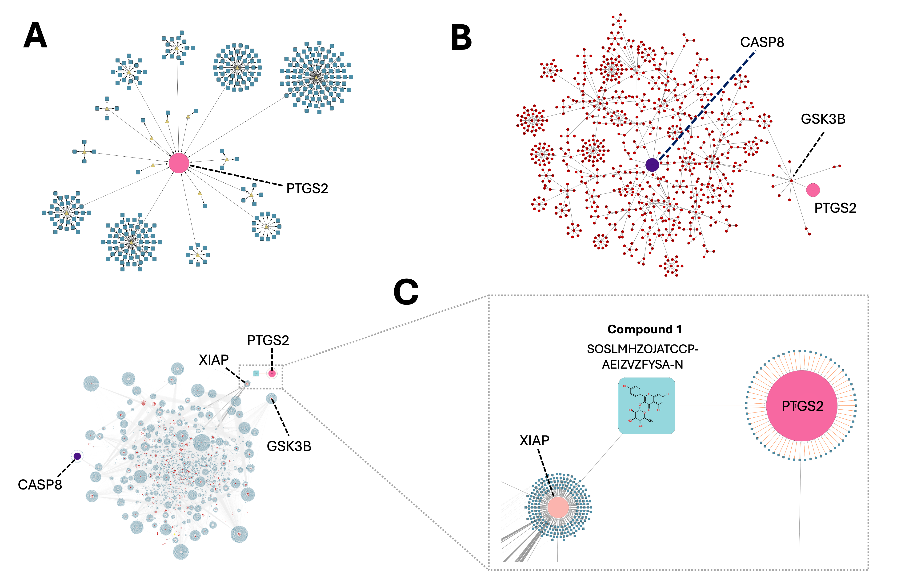

# SmartGraph API

## Cite Us

[Zahoránszky-Kőhalmi G, Walker B, Miller N, Yang B, Penna DVL, Binder J, et al. SmartGraph API: Programmatic Knowledge Mining in Network- Pharmacology Setting. ChemRxiv. 2024; doi:10.26434/chemrxiv-2024-0psx3 This content is a preprint and has not been peer-reviewed.](https://chemrxiv.org/engage/chemrxiv/article-details/65a18b9d9138d23161c824ec)

 

 

 

## Local Deployment

The following deployment steps deploy 3 services used by SmartGraph. The services are:

- SmartGraph API
- SmartGraph Neo4j database
- SmartGraph Web Socket server
  - Used by the SmartGraph UI to connect to Neo4J, for more about the WebSocket server see the README within the 'websocket-server' directory.

### Prerequisites

- Environment template files

This repository contains environment template files that are necessary for the `configure.py` script to generate the single `.env` file for the Docker images.
The template environment files can be found in the `template_config` directory of this repository. Of note, the files in that directory are of demonstrative purposes, and
reflect the structure as key-value pairs. Accordingly, they need to be modified in order to use real values, such as URLS, credentials, etc. tailerd to the environment at hand.

- System support for Docker technology.

- Make sure you have the Smartgraph Neo4j knowldgebase located at the location defined in the `docker-compose.yml` file.
By default, this location is: `$HOME/docker/smartgraph_volume/neo4j_data` .

Note, the SmartGraph Neo4j database for reproducibility purpose is available from the corresponding author of the SmartGraph API paper per request.

### Compiling Docker Containers

- Run configuration script:

`python3 configure.py path_to_config_template_files`

In the command above, replace the "path_to_config_template_files" with the actual path (without trailing slash), e.g.:
`python3 configure.py template_config` . (If using this example,. make sure you modify the content of the files in the `template_config` directory as necessary.)

- From the root of the repository:

`docker-compose -f docker-compose.yml build --parallel`

`docker-compose -f docker-compose.yml up -d`

## Documentation via SWAGGER

Visit `http://127.0.0.1:5070/docs` or use the URL respective to the deployment type (CI/QA/Prod).

## License Related Remarks

This repository contains a `data` subdirectory, all of its content (recursively) falls under the CC BY 4.0 International license as indicated by the `data/LICENSE` file. All other files and directories fall under the MIT source code license as indicated by the `LICENSE` file in the root of this repository. 

Please observe the `data/NOTES` and `NOTES` file (latter in the root of this repository) for additional information in relevant to license issues.